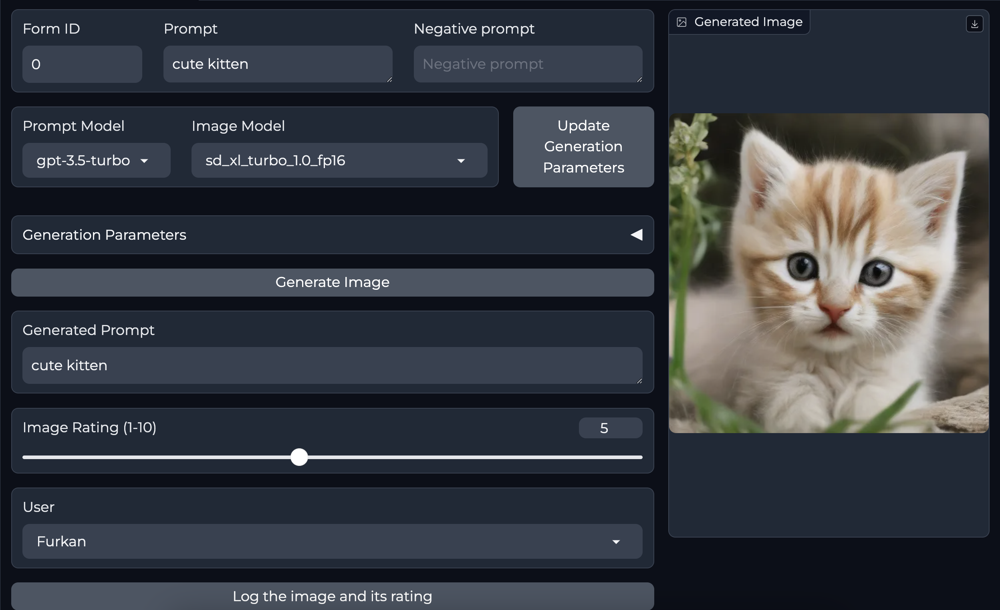

# How to Run
Clone the repo:

`git clone https://github.com/afurkank/img-gen-webui.git`

and run (from inside the **img-gen-webui** directory):

```
docker compose --profile download up --build
# wait until its done, then:
docker compose --profile [ui] up --build
# where [ui] is one of: auto | auto-cpu
```

At this point, the SD model weights should be downloaded and Auto's SD web app
should be accessible by API.

Now, go to **jotform-img-gen** directory and run (I suggest you do this inside a Conda environment with Python version *3.12.4*):

```
pip install -r requirements.txt
```

Finally, run:

```
python3 app.py
```

The web app should be available at **http://localhost:8080/**

Do not forget to put your **.env** file containing your API keys as environment variables inside the **jotform-img-gen** folder.


### Note

Do not select *sd3_medium_incl_clips_t5xxlfp16*. It breaks everything at the moment 🥲

# How to add custom models

Right now adding custom models and Loras is a bit messy since I simply download model weights from wherever their weights are, upload them to my HuggingFace repo, and get the download links from there. So you kind of need to ask me to add models for the time being until I find a better way or until I document this process in more detail so you can do it yourself.

# Image Generation Model Settings

Every model has its own settings that it works well with. You can look up their recommended settings from model cards on HuggingFace or somewhere else.

## Juggernaut X Settings

### Juggernautv9 RDPhoto2 Lightning 4S

- Res: 1024 x 1024
- Sampler: DPM++ SDE or DPM++ SDE Karras
- Steps: 5-7
- CFG: 1.5 - 2

No need for "detailed hands lora" as the model can produce good hands.

### Juggernaut_X_RunDiffusion (VAE is baked in):

- Res: 832*1216 (For Portrait, but any SDXL Res will work fine)
- Sampler: DPM++ 2M Karras
- Steps: 30-40
- CFG: 3-7 (less is a bit more realistic)
- HiRes: 4xNMKD-Siax_200k with 15 Steps and 0.3 Denoise + 1.5 Upscale

### Juggernaut_X_RunDiffusion_Hyper (VAE is baked in):

- Res: 832*1216 (Any SDXL Res will work fine)
- Sampler: DPM++ SDE Karras
- Steps: 4-6
- CFG: 1-2 (recommend 2 for a bit negative prompt affection)
- Negative: Only working slightly on CFG 2
- HiRes: 4xNMKD-Siax_200k with 3 Steps and 0.35 Denoise + 1.5 Upscale

## SDXL-Lightning:

- Res: 1024x1024
- Sampler: Euler - SGM Uniform
- Steps: 4 or 8 (depending on the model which can be sdxl-lightning-4step or sdxl-lightning-8step)
- CFG: 1

# ToDo

- [x] Add custom SD models
- [x] Add Loras
- [x] Add another Docker for 
  - [x] Customizing UI of Automatic1111's **stable-diffusion-webui**
  - [x] Using packages for prompt generation, background removal & Jotform API calls
  - [x] Using Auto's SD web UI as an API
- [x] Create separate sheets for different form ids
- [x] Log user name for rating
- [x] Log drive link to the image
- [x] Log prompt generated by llm
- [x] Test on a machine with GPU

# Prompting Resources

I will update this section as I find useful resources.

- [Prompting guide for the Juggernaut X Models](https://learn.rundiffusion.com/prompting-guide-for-juggernaut-x/)

# Using Auto SD WebUI as an API
One of the Dockers under the "services" folder is the "AUTOMATIC1111" Docker container. This container runs the SD web UI. However, since we will use our own UI here, I instead use that Docker as an API.

Here are some resources for how you can use Auto's web ui as an API:

- [Basic API documentation](https://github.com/AUTOMATIC1111/stable-diffusion-webui/discussions/3734)
- [API Guide](https://github.com/AUTOMATIC1111/stable-diffusion-webui/wiki/API)
- [Stable Diffusion web UI txt2img img2img api example script](https://gist.github.com/w-e-w/0f37c04c18e14e4ee1482df5c4eb9f53)
- [How to use Lora through the API?](https://github.com/AUTOMATIC1111/stable-diffusion-webui/discussions/10468)

# Note
The Docker containers here are not for production use since they were not made with security in mind. Please do not use them in a production setting.

# Disclaimer
This repo was based on [AbdBarho's sd webui docker repo](https://github.com/AbdBarho/stable-diffusion-webui-docker). I just customized it for my needs.
The license specified in the [original repo's license](https://github.com/AbdBarho/stable-diffusion-webui-docker/blob/master/LICENSE) (and any other license specified in the original repo) applies here as well.
